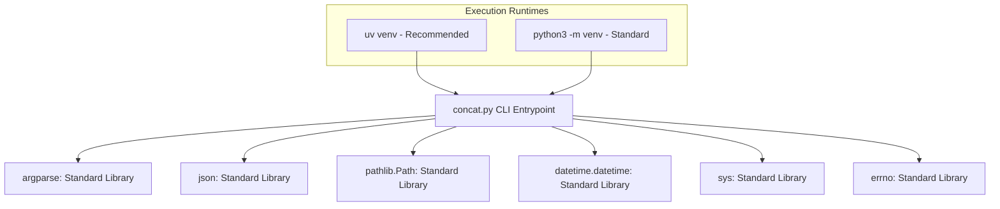
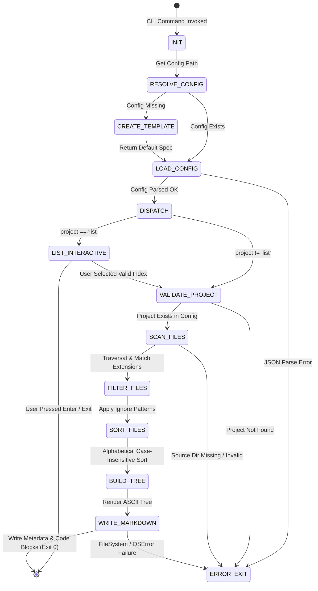

# SYSTEM MASTER SPECIFICATION (SMS)
## Module: LiteConcat Core Engine (v3.0)
**Architectural Standard:** Spec-Driven Development (SDD)  
**Target Execution Framework:** Python 3.10+ Standard Library (Zero External Dependencies)  
**Role:** Single Source of Truth (SSoT) for Compilation, Validation, and AI-Driven Code Generation

---

### 1. METADATOS Y REGLAS GLOBALES DEL SISTEMA (SYSTEM CONTRACTS)

#### 1.1 Restricciones Globales y Principios Arquitectónicos
```yaml
SystemContracts:
  SystemName: "LiteConcat"
  Version: "3.0.0"
  Domain: "Development Tooling / Context Bundler"
  ArchitecturalPattern: "Modular Procedural CLI / Pipeline Processing"
  LanguageStandard: "Python 3.10+"
  TypingStrictness: "Strict Type Hints (PEP 484 / PEP 604 union types)"
  DependencyPolicy: "Zero Third-Party Packages (Pure Python Standard Library)"
  EncodingStandard: "UTF-8 with BOM (utf-8-sig) for Windows/WSL cross-compatibility"
  NamingConventions:
    Functions: "snake_case (Internal helpers prefixed with _)"
    Variables: "snake_case"
    Constants: "SCREAMING_SNAKE_CASE"
    ConfigFiles: ".concat_projects.json"
  OSCompatibility:
    - "Linux (POSIX)"
    - "macOS"
    - "Windows Subsystem for Linux (WSL2 / drvfs)"
  ErrorHandlingStrategy: "Fail-Fast with ANSI Colored Output and Exit Code 1 on error"
```

#### 1.2 Grafo de Dependencias del Entorno


---

### 2. ESPECIFICACIÓN DE LA CAPA DE DATOS (DATA SHEETS)

#### 2.1 JSON Schema: Configuración del Sistema (`.concat_projects.json`)
```json
{
  "$schema": "https://json-schema.org/draft/2020-12/schema",
  "title": "LiteConcatProjectsConfig",
  "type": "object",
  "patternProperties": {
    "^[a-zA-Z0-9_-]+$": {
      "$ref": "#/$defs/ProjectDefinition"
    }
  },
  "additionalProperties": false,
  "$defs": {
    "ProjectDefinition": {
      "type": "object",
      "properties": {
        "source": {
          "type": "string",
          "description": "Absolute or home-relative (~) path to the target source directory."
        },
        "output": {
          "type": "string",
          "description": "Base directory path where concatenated Markdown notes will be placed."
        },
        "note-name": {
          "type": "string",
          "description": "Base filename for the output note. If extension is missing, '.md' is appended automatically."
        },
        "versionar": {
          "type": "boolean",
          "description": "Legacy toggle for timestamping. System v3.0 defaults to automatic timestamping.",
          "default": false
        },
        "extensions": {
          "type": "array",
          "items": {
            "type": "string"
          },
          "description": "List of target file extensions (e.g., '.py') or exact filenames (e.g., 'Dockerfile')."
        },
        "ignore": {
          "type": "array",
          "items": {
            "type": "string"
          },
          "description": "Substrings or directory names to filter out during recursive traversal."
        }
      },
      "required": ["source", "output", "extensions", "ignore"]
    }
  }
}
```

#### 2.2 TypeScript Definitions: Entidades Internas y AST de Salida
```typescript
/** Configuración de un proyecto individual */
export interface ProjectConfig {
  source: string;
  output: string;
  "note-name"?: string;
  versionar?: boolean;
  extensions: string[];
  ignore: string[];
}

/** Mapa de proyectos por nombre */
export type ProjectConfigMap = Record<string, ProjectConfig>;

/** Nodo del Árbol de Directorios (AST de Tabla de Contenidos) */
export interface DirectoryTreeNode {
  __files__?: string[];
  [directoryName: string]: DirectoryTreeNode | string[] | undefined;
}

/** Objeto Metadata de Archivo Procesado */
export interface ProcessedFileEntry {
  absolutePath: string;
  relativePath: string;
  createdAt: string; // Formato: YYYY-MM-DD HH:MM:SS
  modifiedAt: string; // Formato: YYYY-MM-DD HH:MM:SS
  language: string;
  content: string;
}

/** Documento de Salida Markdown */
export interface OutputMarkdownDocument {
  titleHeader: string; // `# Project: {project_name}`
  tableOfContents: {
    title: string; // `## Tabla de Contenido (Estructura de archivos)`
    treeAsciiBlock: string;
  };
  fileSections: ProcessedFileEntry[];
}
```

---

### 3. CONTRATOS DE INTERFAZ DE ENTRADA/SALIDA (API / INTERFACE SPECS)

#### 3.1 CLI Command Line Interface Spec
```typescript
namespace LiteConcatCLI {
  export interface ExecutionRequest {
    command: "concat";
    arguments: {
      project: string; // Nombre del proyecto o el comando literal "list"
    };
    environment: {
      CWD: string;
      HOME: string;
      TERM_ANSI: boolean;
    };
  }

  export type SuccessResponse = {
    exitCode: 0;
    stdout: string;
    targetFileCreated?: string;
    totalFilesConcatenated?: number;
  };

  export type ErrorResponse = {
    exitCode: 1;
    stderr: string;
    errorType: "CONFIG_NOT_FOUND" | "CONFIG_PARSE_ERROR" | "PROJECT_NOT_FOUND" | "INVALID_SOURCE" | "FILE_SYSTEM_OS_ERROR";
  };
}
```

#### 3.2 Internal Function Signatures Contract
```typescript
/** Resolución jerárquica de la ruta de configuración */
function get_config_path(): Path;

/** Carga y parseo seguro de configuración JSON con generación de plantilla fallback */
function load_config(config_path: Path): ProjectConfigMap;

/** Menú interactivo de selección cuando el argumento es 'list' */
function list_projects(config: ProjectConfigMap, config_path: Path): void;

/** Ejecución determinista del pipeline de concatenación para un proyecto */
function concat_project(project_name: string, config: ProjectConfigMap, config_path: Path): void;

/** Conversión de lista de rutas relativas a estructura jerárquica de árbol */
function _paths_to_tree(relative_paths: Path[]): DirectoryTreeNode;

/** Renderizado recursivo de árbol a líneas en formato ASCII */
function _render_tree(tree: DirectoryTreeNode, prefix?: string): string[];
```

---

### 4. MÁQUINA DE ESTADOS Y LÓGICA DE NEGOCIO (STATE MACHINES & LOGIC)

#### 4.1 Diagrama de Estados del Pipeline de Ejecución


#### 4.2 Algoritmo Determinista de Selección y Filtrado de Archivos
```python
# Pseudocódigo Estructurado Determinista
def execute_file_filtering_pipeline(source_dir: Path, proj_config: ProjectConfig) -> List[Path]:
    target_exts = {ext if ext.startswith(".") else f".{ext}" for ext in proj_config.extensions}
    target_names = {ext for ext in proj_config.extensions if not ext.startswith(".")}
    ignore_set = set(proj_config.ignore)

    valid_paths = []
    
    for path in source_dir.rglob("*"):
        if not path.is_file():
            continue

        # Invariante de ignorado: Si cualquier parte del path coincide con ignore, descarte inmediato
        if any(ignored in path.parts for ignored in ignore_set):
            continue

        if path.suffix in target_exts or path.name in target_names:
            valid_paths.append(path)

    # Invariante de Ordenamiento: Orden alfabético case-insensitive de la ruta relativa
    valid_paths.sort(key=lambda p: str(p.relative_to(source_dir)).lower())
    return valid_paths
```

#### 4.3 Invariantes de Negocio (Reglas Inviolables)
1. **INVARIANTE 01 (Safe Output Pathing):** La ruta final del archivo de salida NUNCA debe ejecutar `.resolve()` sobre la concatenación final de `output_file` para evitar errores `OSError 19 / ENODEV` en sistemas de archivos montados (WSL2 / drvfs / Windows drives).
2. **INVARIANTE 02 (Timestamp Format):** Todos los archivos de salida generados DEBEN incluir una estampa temporal con el formato exacto `-YY-MM-DD.HH-MM-SS` antes de la extensión.
3. **INVARIANTE 03 (Deterministic Tree Construction):** El árbol de directorios renderizado en la Tabla de Contenidos DEBE listar directorios con sufijo `/` antes que los archivos del mismo nivel, ordenados alfabéticamente sin distinción de mayúsculas/minúsculas.
4. **INVARIANTE 04 (Encoding Integrity):** Todos los archivos escritos DEBEN usar codificación `utf-8-sig` para mantener la integridad de caracteres especiales en entornos multiplataforma.
5. **INVARIANTE 05 (Zero Dependency Lock):** El núcleo de la aplicación NUNCA debe importar librerías fuera de la librería estándar de Python (`stdlib`).

---

### 5. ESPECIFICACIÓN DE INSERCIÓN Y EXTENSIBILIDAD (EXTENSION POINTS)

#### 5.1 Puntos de Extensión (Architectural Hooks)
Los agentes de IA y desarrolladores deben inyectar nuevas funcionalidades utilizando exclusivamente los siguientes puntos de desacoplamiento:

```typescript
// Architectural Hook #1: Custom Output Formatters
export interface IOutputFormatter {
  formatHeader(projectName: string): string;
  formatTree(tree: DirectoryTreeNode): string;
  formatFileEntry(entry: ProcessedFileEntry): string;
}

// Architectural Hook #2: File Matching Strategy
export interface IFileMatcher {
  shouldInclude(path: Path, sourceDir: Path, config: ProjectConfig): boolean;
}

// Architectural Hook #3: Configuration Provider
export interface IConfigLoader {
  resolveConfigPath(): Path;
  load(path: Path): ProjectConfigMap;
}
```

#### 5.2 Reglas para Inyección de Funcionalidades por Agentes de IA
1. **Adición de nuevos formatos de salida (ej. HTML, JSON AST):**
   - Crear una clase o módulo transformador que reciba `OutputMarkdownDocument` o un iterador de `ProcessedFileEntry`.
   - NUNCA alterar la lógica de recorrido recursivo `rglob` en `concat_project`.
2. **Nuevas reglas de filtrado (ej. `.gitignore` parsing):**
   - Inyectar el filtro dentro de la primera pasada (*First pass*) de `concat_project` agregando evaluadores a `valid_paths`.
3. **Modificación de banderas CLI:**
   - Ampliar la instancia `argparse.ArgumentParser` en `main()`.
   - Preservar la compatibilidad hacia atrás del argumento posicional `project`.
